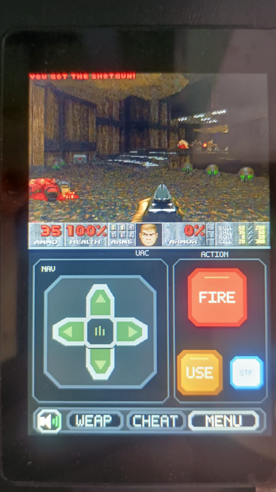
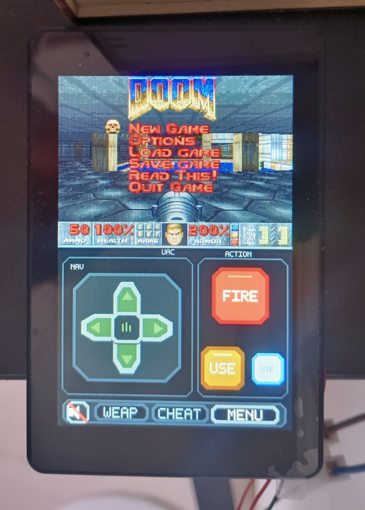
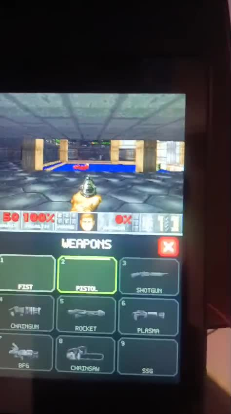
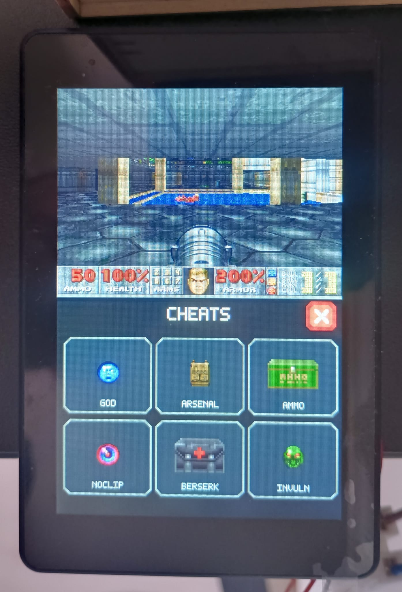

# DOOMESP

[English documentation](README.md)

DOOM tourne nativement sur la **GUITION JC3248W535** : ESP32-S3, écran
tactile capacitif AXS15231B QSPI 320 x 480, 16 Mio de flash, 8 Mio de PSRAM
octale, lecteur microSD et amplificateur audio NS4168.

Le jeu conserve son rendu original en 320 x 200. Le véritable HUD de DOOM,
toujours dynamique, est affiché juste sous l'image et le reste de l'écran
devient une manette tactile multipoint.

<p align="center">
  
  
</p>

<p align="center">
  
  
</p>

Voir la
[démonstration du gameplay](https://cdn.jsdelivr.net/gh/Kharn27/DOOMESP@main/docs/media/gameplay-demo.mp4)
et la vidéo des
[commandes tactiles et du sélecteur d'armes](https://cdn.jsdelivr.net/gh/Kharn27/DOOMESP@main/docs/media/touch-controls.mp4).

## Fonctionnalités

- Affichage fluide du jeu en 320 x 200, en mode portrait.
- HUD original 320 x 32 déplacé sous le jeu sans le figer ni le réinventer.
- Tactile capacitif à deux points : déplacement et tir simultanés.
- D-pad, tir, utilisation, mode strafe persistant et menu.
- Sélecteur d'armes utilisant les sprites du WAD chargé.
- Écran tactile des cheats classiques.
- Huit canaux d'effets sonores et musique MUS synthétisée en OPL3.
- Coupure instantanée de tout l'audio.
- IWAD et configuration sur carte microSD FAT32.

Le réseau n'est pas encore implémenté : cette version est uniquement solo.

## Matériel nécessaire

- Une carte GUITION portant exactement la référence **JC3248W535**.
- Une carte microSD formatée en FAT32.
- Un câble USB permettant le transfert de données.
- Facultatif : un haut-parleur branché sur la sortie amplifiée de la carte.
  Un modèle 8 ohms / 1,5 W a été testé avec succès.
- Un IWAD compatible obtenu légalement.

Consulte le [guide matériel](docs/HARDWARE.fr.md) pour les bus et GPIO exacts.

## Installation rapide

### Préparer la microSD

Copier à la racine de la carte un des fichiers suivants, en minuscules :

`doom2f.wad`, `doom2.wad`, `plutonia.wad`, `tnt.wad`, `doomu.wad`,
`doom.wad` ou `doom1.wad`.

Cet ordre est aussi l'ordre de priorité lorsqu'il y en a plusieurs. Aucun WAD
ni contenu commercial de DOOM n'est fourni dans ce dépôt. Le firmware crée
ensuite `/default.cfg` sur la carte.

### Avec VS Code

1. Installer [Visual Studio Code](https://code.visualstudio.com/) et
   l'extension [PlatformIO IDE](https://docs.platformio.org/en/latest/integration/ide/vscode.html).
2. Cloner le dépôt puis ouvrir `DOOMESP.code-workspace`.
3. Ouvrir `ESP32/platformio.ini` et choisir l'environnement `jc3248w535`.
4. Connecter la carte et lancer **PlatformIO: Upload**.
5. Insérer la microSD préparée puis redémarrer la carte.

Le premier build télécharge ESP-IDF et le pilote AXS15231B d'Espressif.

### En ligne de commande

Depuis la racine du dépôt :

```sh
pio run -d ESP32
pio run -d ESP32 -t upload
pio device monitor --baud 115200
```

Pour imposer le port série sous Linux :

```sh
pio run -d ESP32 -t upload --upload-port /dev/ttyACM0
pio device monitor --port /dev/ttyACM0 --baud 115200
```

Sous Windows, utiliser le port `COM` correspondant.

## Commandes tactiles

| Commande | Action |
| --- | --- |
| D-pad haut/bas | Avancer/reculer |
| D-pad gauche/droite | Tourner, ou faire un pas latéral quand `STF` est actif |
| `FIRE` | Tirer et valider dans les menus |
| `USE` | Ouvrir une porte ou activer un interrupteur |
| `STF` | Activer/désactiver le strafe ; bleu signifie actif |
| Haut-parleur | Couper/rétablir les sons et la musique |
| `WEAP` | Ouvrir le choix des armes |
| `CHEAT` | Ouvrir l'écran des cheats |
| `MENU` | Ouvrir/fermer le menu original de DOOM |

## Pour aller plus loin

- [Architecture du port](docs/ARCHITECTURE.fr.md)
- [Matériel et brochage](docs/HARDWARE.fr.md)
- [Portage vers une autre carte ESP32-S3](docs/PORTING.fr.md)
- [Dépannage](docs/TROUBLESHOOTING.fr.md)
- [Différences avec LinuxDOOM](docs/UPSTREAM.fr.md)
- [Licences tierces](THIRD_PARTY.fr.md)
- [Contribuer](CONTRIBUTING.fr.md)
- [Journal des modifications](CHANGELOG.fr.md)

Le code est distribué sous GNU GPL version 2. Les données commerciales de
DOOM ne font pas partie de cette licence et ne sont pas incluses.
