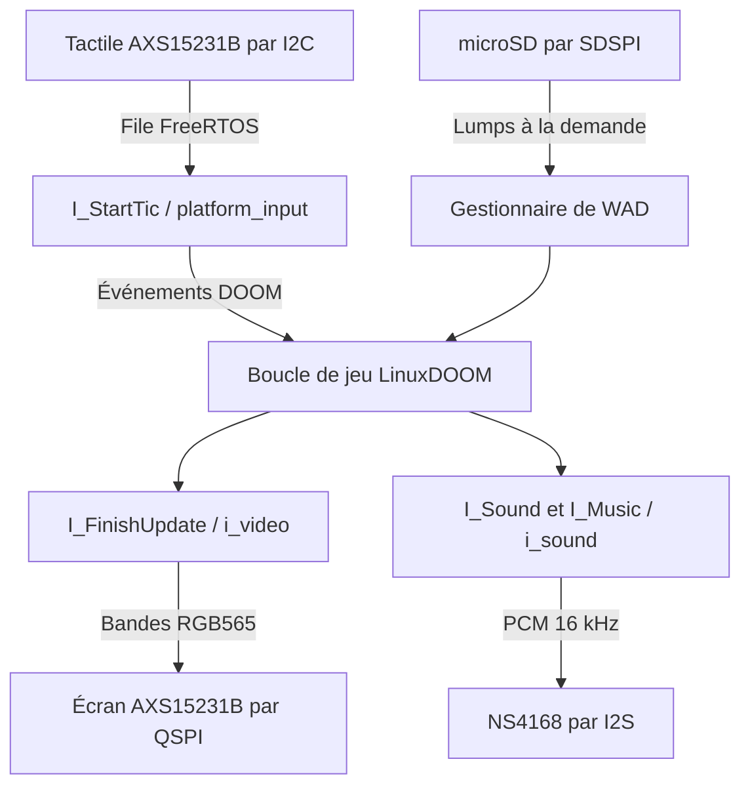

# Architecture

[English version](ARCHITECTURE.md)

DOOMESP conserve la frontière de portabilité prévue par LinuxDOOM : le code
du jeu appelle des fonctions dont le nom commence par `I_`, et la cible
fournit ces fonctions. Le port ESP32 ne duplique ni le moteur de rendu ni la
boucle de jeu.

## Couches

| Couche | Emplacement | Responsabilité |
| --- | --- | --- |
| Moteur du jeu | `linuxdoom-1.10/` | Rendu, simulation, menus, barre d'état et cache WAD |
| Enveloppe ESP-IDF du moteur | `ESP32/components/doom/` | Sélectionne les sources du moteur et exclut les backends PC |
| Backends DOOM de la cible | `ESP32/src/i_*.c` | Implémente la vidéo, le son, le transfert des entrées et les stubs réseau solo |
| Services de la carte | `ESP32/src/platform/` | LCD, tactile, microSD, temps, dessin des commandes et définition de la carte |
| Dépendances musicales | `ESP32/components/doom_music/` | Lecture du MUS et génération des échantillons OPL |

Cette organisation est volontairement conservatrice. Déplacer LinuxDOOM
dans une arborescence de composants personnalisée rendrait le dépôt plus
symétrique, mais masquerait sa relation avec l'upstream et compliquerait les
comparaisons futures. L'enveloppe de build actuelle fournit un composant à
ESP-IDF sans rendre méconnaissable l'arborescence du code source publié.

## Flux des données à l'exécution

## Chaîne d'affichage

DOOM produit toujours un framebuffer indexé 8 bits de 320 x 200 pixels.
`i_video.c` le convertit en RGB565 à l'aide de la palette PLAYPAL active,
puis le place en PSRAM. `platform_lcd.c` transmet le résultat à l'écran sous
forme de bandes DMA de 20 lignes.

La barre d'état originale n'est ni copiée une seule fois ni redessinée par
l'interface personnalisée. Lorsque la vue 3D est en plein écran, un petit
hook dans `d_main.c` redirige temporairement `screens[0]` vers un tampon hors
écran et appelle le propre `ST_Drawer` de DOOM. Les 320 x 32 pixels obtenus
sont placés directement sous le jeu. La santé, les munitions, l'armure, les
clés, les armes possédées et le visage du Doomguy restent donc pilotés par le
moteur original.

Les commandes personnalisées occupent l'espace restant. Le framebuffer
inférieur est mis en cache et redessiné seulement lorsque son état change :
son, strafe, armes possédées ou écran modal. Toutes les écritures physiques
vers le LCD restent dans la tâche de jeu/rendu ; la tâche tactile ne fait que
modifier l'état et placer des événements en file d'attente.

Les illustrations des armes et des cheats sont copiées une fois depuis
l'IWAD dans un petit cache dédié en PSRAM. L'interface ne conserve aucun
pointeur vers le cache de lumps purgeable de DOOM : le moteur peut donc
reclasser ou évincer les mêmes sprites pendant les démos et changements de
niveau sans invalider les icônes des sélecteurs.

## Chaîne des entrées

Le contrôleur tactile AXS15231B rapporte deux contacts avec des identifiants
stables. La tâche tactile pilotée par interruption associe chaque nouveau
contact à une commande logique et conserve cette association jusqu'au
relâchement. Elle combine les contacts en événements de joystick DOOM
vanilla, placés dans une file consommée par `I_StartTic`.

Points importants :

- L'appui et le relâchement courts sont livrés sur deux tics de jeu distincts
  pour éviter qu'ils ne s'annulent avant que DOOM observe l'appui.
- Le maintien des directions du D-pad est répété pour les menus originaux.
- Lors d'un changement d'écran, les contacts existants sont ignorés jusqu'à
  ce que tous les doigts soient relevés.
- Le choix des armes utilise une file de requêtes séparée, car la touche `1`
  de DOOM vanilla alterne entre le poing et la tronçonneuse au lieu de
  sélectionner précisément le poing.
- `STF` verrouille le bouton 1 du joystick uniquement pendant le jeu. Dans le
  menu original, ce bit représente Retour arrière ; il y est donc supprimé
  volontairement.

## Chaîne audio

`i_sound.c` implémente les points d'entrée LinuxDOOM des effets sonores et de
la musique. Les lumps audio sont mis en cache en PSRAM, mélangés sur huit
canaux logiciels et combinés au flux musical. LittleMUS interprète les
événements MUS et la banque GENMIDI du WAD ; Woody-OPL synthétise des
échantillons OPL stéréo ensuite repliés vers la sortie mono de la carte.

Une tâche FreeRTOS dédiée produit des tampons de 256 trames à 16 kHz et les
écrit en continu sur l'I2S. Un mutex protège l'état du mixeur modifié par la
tâche DOOM. La coupure du son intervient dans l'étage final du mixage : la
chronologie musicale et les canaux actifs continuent donc normalement.

## Stockage et mémoire

- La carte microSD est montée sur `/sdcard` par le VFS FAT d'ESP-IDF.
- LinuxDOOM reçoit des chemins absolus pour l'IWAD et la configuration.
- Les répertoires WAD sont validés, mais les lumps sont lus à la demande.
- La zone mémoire de 6 Mio de DOOM est allouée en PSRAM.
- Les framebuffers RGB, la barre d'état, l'interface mise en cache et les
  sons privilégient la PSRAM.
- Les tampons DMA et allocations sensibles à la latence restent en RAM
  interne.
- Le firmware utilise une partition applicative de 4 Mio ; les WAD restent
  sur la carte SD.

## Configuration propre à la carte

Chaque bus, GPIO et fréquence validé physiquement est défini dans
`ESP32/src/platform/platform_board.h`. La géométrie des commandes à l'écran
reste séparée dans `platform_controls.h`, car elle décrit l'interface et non
le circuit imprimé.

Pour prendre en charge une autre révision de carte AXS15231B :

1. Créer ou sélectionner une définition de carte avec un brochage vérifié.
2. Valider la séquence d'initialisation et le timing de balayage de l'écran.
3. Valider l'orientation tactile et les coordonnées brutes.
4. Ajouter un environnement PlatformIO distinct au lieu de réutiliser
   silencieusement `jc3248w535`.
5. Documenter et tester la topologie flash/PSRAM avant de modifier
   `sdkconfig.defaults`.

Il s'agit de la frontière de configuration actuelle, pas encore d'une
abstraction matérielle complète. `platform_lcd.c` mélange encore le transport
AXS15231B et le dessin de l'interface, tandis que `platform_input.c` regroupe
le décodage des paquets propres au contrôleur et leur transformation en
commandes logiques.

L'évolution visée consiste à sélectionner un profil de carte à la compilation
et à fournir de petits backends matériels distincts pour l'affichage, le
tactile, le stockage et l'audio. L'interface tactile et le comportement `I_*`
vu par DOOM doivent rester partagés. Cette séparation sera introduite
progressivement à partir d'une vraie deuxième cible : la JC3248W535 restera
ainsi un test physique de non-régression et les interfaces correspondront à
des contraintes matérielles réelles.

Consulte [PORTING.fr.md](PORTING.fr.md) pour la matrice des couplages actuels,
les frontières proposées, l'ordre de migration et la checklist de validation
matérielle.

## Modifications du moteur

Certaines modifications doivent rester dans LinuxDOOM, car aucun callback
`I_*` original n'existe à l'endroit nécessaire — notamment pour détacher la
barre d'état. Elles restent petites et sont généralement protégées par
`DOOM_ESP32`. Consulte [UPSTREAM.fr.md](UPSTREAM.fr.md) pour l'inventaire et
la politique complète.
