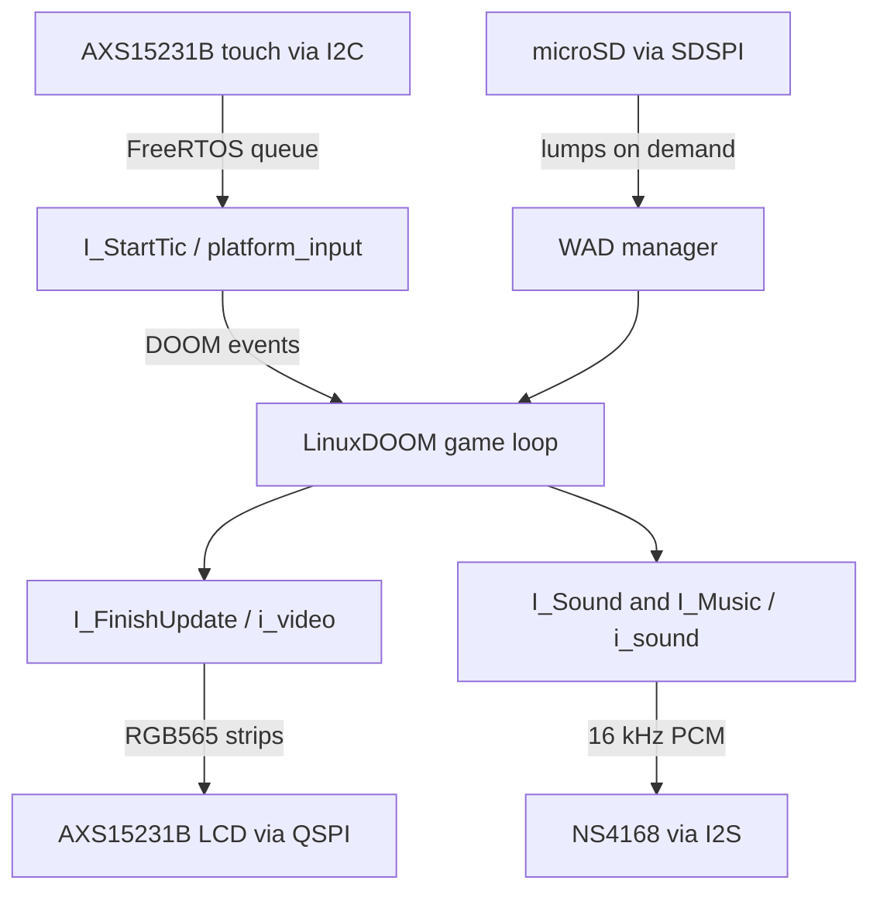

# Architecture

DOOMESP keeps the original LinuxDOOM portability boundary: game code calls
functions whose names start with `I_`, while the target supplies those
functions. The ESP32 port does not duplicate the renderer or game loop.

## Layers

| Layer | Location | Responsibility |
| --- | --- | --- |
| Game engine | `linuxdoom-1.10/` | Renderer, simulation, menus, status bar, WAD cache |
| ESP-IDF engine wrapper | `ESP32/components/doom/` | Selects the engine sources and excludes the PC backends |
| DOOM target backends | `ESP32/src/i_*.c` | Implements video, sound, input handoff, and single-player networking stubs |
| Board services | `ESP32/src/platform/` | LCD, touch, microSD, time, control-panel drawing, and board definition |
| Music dependencies | `ESP32/components/doom_music/` | MUS parsing and OPL sample generation |

This layout is intentionally conservative. Moving LinuxDOOM into a custom
component tree would make the repository look tidier but would hide the
upstream relationship and make future comparisons harder. The current build
wrapper gives ESP-IDF a component without changing the recognizable source
release layout.

## Runtime data flow

## Display pipeline

DOOM still renders an indexed 8-bit 320 x 200 framebuffer. `i_video.c`
converts it through the active PLAYPAL palette into RGB565 stored in PSRAM.
`platform_lcd.c` transmits the result to the panel in 20-line DMA strips.

The original status bar is not copied once or recreated by the custom UI.
When the 3-D view is full screen, a small hook in `d_main.c` temporarily
redirects `screens[0]` to an off-screen buffer and calls DOOM's own
`ST_Drawer`. The resulting live 320 x 32 pixels are placed directly under the
game. Health, ammo, armor, keys, weapon ownership, and Doomguy's face therefore
remain driven by the original engine.

The custom controls occupy the remaining area. A cached lower framebuffer is
redrawn only when its state changes, such as mute, strafe, weapon ownership,
or modal selection. All physical LCD writes remain on the game/render task;
the touch task only changes state and queues events.

## Input pipeline

The AXS15231B touch controller reports two contacts with stable IDs. The
interrupt-driven touch task maps each new contact to one logical control and
keeps that ownership until release. It combines the contacts into vanilla
DOOM joystick events and places them in a queue consumed by `I_StartTic`.

Important details:

- A short press and release are delivered on separate game tics, preventing
  them from cancelling before DOOM observes the press.
- Held D-pad directions are repeated for the original menu system.
- UI transitions ignore existing contacts until every finger is lifted.
- Weapon selection uses a separate request queue because vanilla key `1`
  alternates fist and chainsaw instead of selecting the fist exactly.
- `STF` latches joystick button 1 only during active gameplay. In the
  original menu that bit means Backspace, so it is deliberately suppressed
  there.

## Audio pipeline

`i_sound.c` implements both LinuxDOOM sound-effect and music entry points.
Sound lumps are cached in PSRAM, mixed over eight software channels, and
combined with the music stream. LittleMUS parses the WAD's MUS events and
GENMIDI bank; Woody-OPL synthesizes stereo OPL samples which are folded into
the board's mono output.

A dedicated FreeRTOS task produces 256-frame buffers at 16 kHz and writes
them continuously to I2S. A mutex protects mixer state changed by the DOOM
task. Muting happens inside the final mixer stage, so music timing and active
sound channels continue normally.

## Storage and memory

- The microSD card is mounted at `/sdcard` through ESP-IDF's FAT VFS.
- LinuxDOOM receives absolute IWAD and configuration paths.
- WAD directories are validated, but lump payloads are read on demand.
- The 6 MiB DOOM zone is allocated in PSRAM.
- RGB framebuffers, status-bar buffers, cached UI, and sound samples prefer
  PSRAM.
- DMA buffers and latency-sensitive allocations remain in internal RAM.
- The firmware uses a 4 MiB application partition; WAD data stays on SD.

## Board-specific configuration

Every tested physical bus, GPIO, and clock is defined in
`ESP32/src/platform/platform_board.h`. Screen-space control geometry is kept
separately in `platform_controls.h` because it describes the UI rather than
the PCB.

To support another AXS15231B board revision:

1. Create or select a board definition with its verified pin map.
2. Validate the panel initialization sequence and raster timing.
3. Validate touch orientation and raw coordinates.
4. Add a distinct PlatformIO environment instead of silently reusing
   `jc3248w535`.
5. Document and test flash/PSRAM topology before changing `sdkconfig.defaults`.

## Engine modifications

Some changes must live in LinuxDOOM because no original `I_*` callback exists
at the required point, notably detached status-bar rendering. They are kept
small and generally guarded by `DOOM_ESP32`. See [UPSTREAM.md](UPSTREAM.md)
for the complete policy and inventory.

