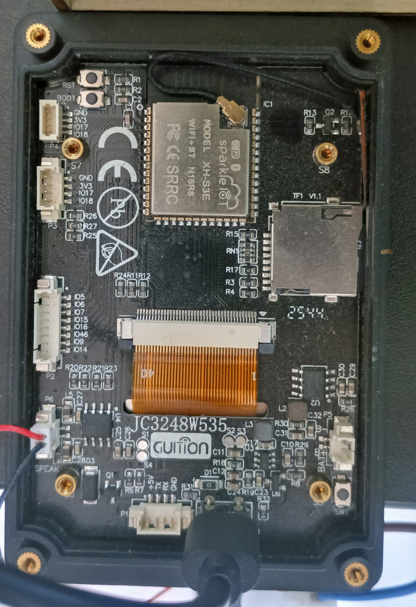
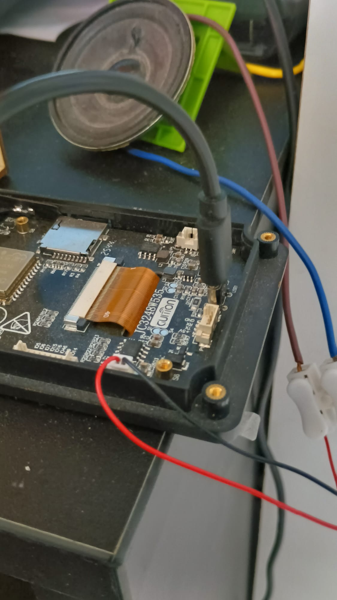

# Hardware

[Version française](HARDWARE.fr.md)

## Tested target

The working target is the black GUITION board marked **JC3248W535** on its
PCB. The tested unit reports:

- ESP32-S3, 240 MHz.
- 16 MiB SPI flash.
- 8 MiB octal PSRAM at 80 MHz.
- AXS15231B 320 x 480 QSPI LCD.
- Two-point capacitive touch over I2C.
- microSD socket.
- NS4168 mono audio amplifier.

Do not rely only on the screen size or product photo. Other boards using an
AXS15231B can route the same devices to different GPIOs and may require a
different panel initialization sequence.

This page documents the tested target, not a generic ESP32-S3 wiring recipe.
See [the porting guide](PORTING.md) before adapting the firmware to another
board or display.

  

## Verified pin map

The source of truth is
[`platform_board.h`](../ESP32/src/platform/platform_board.h).

| Function | Peripheral | Signal | GPIO |
| --- | --- | --- | ---: |
| LCD | SPI2 QSPI | CS | 45 |
| LCD | SPI2 QSPI | CLK | 47 |
| LCD | SPI2 QSPI | D0 | 21 |
| LCD | SPI2 QSPI | D1 | 48 |
| LCD | SPI2 QSPI | D2 | 40 |
| LCD | SPI2 QSPI | D3 | 39 |
| LCD | GPIO | Backlight | 1 |
| Touch | I2C0 | SDA | 4 |
| Touch | I2C0 | SCL | 8 |
| Touch | GPIO | Interrupt | 3 |
| microSD | SPI3 | CS | 10 |
| microSD | SPI3 | MOSI | 11 |
| microSD | SPI3 | CLK | 12 |
| microSD | SPI3 | MISO | 13 |
| Audio | I2S0 | BCLK | 42 |
| Audio | I2S0 | LRCLK/WS | 2 |
| Audio | I2S0 | DATA | 41 |

The LCD runs at a 40 MHz pixel/SPI clock. The SD bus is deliberately limited
to 10 MHz for reliable operation with the on-board routing. Touch I2C runs at
400 kHz. Audio output is 16-bit stereo I2S at 16 kHz with the mono sample
duplicated to both slots for the amplifier.

## Speaker

Use the board's amplified speaker output, not an ESP32 GPIO. An 8 ohm,
1.5 W speaker has been tested and is already loud for a small enclosure.
Secure the speaker mechanically: low-frequency weapon sounds can make a loose
speaker vibrate against the desk or its own leads.

  

The touch speaker icon mutes the final mix. DOOM's own sound and music volume
settings still apply independently.

## Flash and PSRAM configuration

`sdkconfig.defaults` enables octal PSRAM at 80 MHz, reserves 64 KiB of
internal memory for DMA/internal-only allocations, selects a 240 MHz CPU, and
sets a 24 KiB main-task stack. The selected PlatformIO board definition
provides the tested 16 MiB flash and 8 MiB PSRAM topology.

The custom partition table allocates 4 MiB to the firmware:

| Partition | Offset | Size |
| --- | ---: | ---: |
| NVS | `0x9000` | 24 KiB |
| PHY init | `0xF000` | 4 KiB |
| Factory app | `0x10000` | 4 MiB |

The remaining flash is currently unallocated. It leaves room for future OTA
or asset partitions without forcing WAD data into flash.

## Power and USB

Use a data-capable USB cable and a supply that remains stable with the LCD
backlight and speaker active. On Linux the native USB Serial/JTAG interface
usually appears as `/dev/ttyACM0`; Windows assigns a `COM` port.
